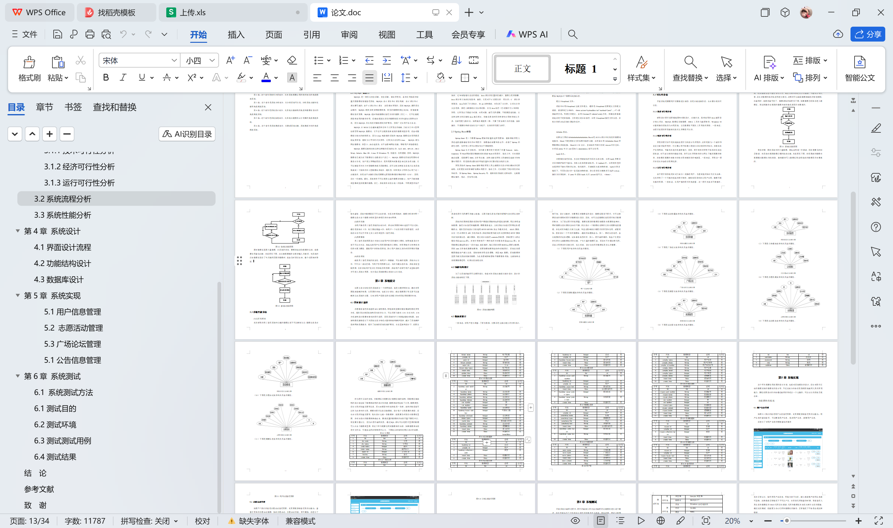

# springboot223-基于SpringBoot的志愿服务管理系统

>  博主介绍：
>  Hey，我是程序员Chaers，一个专注于计算机领域的程序员
>  十年大厂程序员全栈开发‍ 日常分享项目经验 解决技术难题与技术推荐 承接各类网站设计，小程序开发，毕设等。
>  【计算机专业课程设计，毕业设计项目，Java，微信小程序，安卓APP都可以做，不仅仅是计算机专业，其它专业都可以】

## 本项目获取地址：https://www.bishecode.com/product/219/

## 3000套系统可挑选，获取链接：https://www.bishecode.com/

### 系统架构

> 前端：html | js | css | jquery | vue
>
> 后端：springboot | mybatis
> 
> 环境：jdk1.8+ | mysql | maven

# 一、内容包括
包括有  项目源码+项目论文+数据库源码+答辩ppt+远程调试成功

# 二、运行环境

> jdk版本：1.8 及以上； ide工具：IDEA； 数据库: mysql5.7及以上；编程语言: Java

# 三、需求分析

**3.1可行性分析**

尽管系统是根据用户的要求进行制作，但是在确定制作前，有必要分析其可行性。

**3.1.1技术可行性分析**

研发设计程序流程挑选面向对象设计、功能齐全、简单实用的Java编程设计核心理念。MySQL数据库存储数据。IDEA工具作为编程软件，Windows 10计算机操作系统作为应用系统，以及数据库可视化工具等技术职称。一般来说，该程序流程的开发能够从技术上开展是可行的。

**3.1.2经济可行性分析**

开发的程序并不是向着商业程序方向设计与开发的，反而是做为一个新的毕业论文新项目开发的。它主要运用于检测小朋友们在院校所学的知识，并锻练客户使用网络、书籍和其他方式自学能力。因而，程序软件的开发不容易涉及到边际收益，也不会为软件的挑选付钱。你可以在开发软件的官网上下载所需要的软件，并依据所需要的安装方法将应用安装到你的电脑里。一般来说，开发这一程序并没有社会经济发展花费。

**3.1.3运行可行性分析**

由于程序软件就是针对大部分一般操作用户，考虑到他的知识与文化水准，尤其开发了一个可操作度高的程序软件，能够轻而易举地让用户应用，数据可视化操作页面。一般来说，从用户操作程序的角度看，这一程序其实并不难操作。只需用户开启程序，就能避免专职人员学习培训开展程序作用操作。

**3.2系统流程分析**

本系统在处理数据时，其内部的操作逻辑也需要使用相应的工具进行展示。
在本系统的数据录入页面，对于操作者提供的每条数据都有相应的检验规则，比如数据信息不能有非法字符，或者本来应该是汉字的数据，不能用字母代替，还有对数据内容的长度等进行规范，这样的可以确保数据准确性的检验规则，在编码时，就提前编写好了。数据添加的流程见下图。如果数据已经保存进入数据库，则说明操作者提供的数据内容和格式都是符合要求的。

# 四、功能模块

为了让系统的编码可以顺利进行，特意对本系统功能进行细分设计，设计的系统功能结构见下图。

# 五、效果图展示【部分效果图】

图5.1 用户信息管理页面【如图5.1显示的就是用户信息管理页面，此页面提供给管理员的功能有：用户信息的查询管理，可以删除用户信息、修改用户信息、新增用户信息】

图5.2 志愿活动管理页面【如图5.2显示的就是志愿活动管理页面，此页面提供给管理员的功能有：查看已发布的志愿活动数据，修改志愿活动，志愿活动作废，即可删除，还进行了对志愿活动名称的模糊查询 志愿活动信息的类型查询等等一些条件。】

图5.3 广场论坛管理页面【如图5.3显示的就是广场论坛管理页面，此页面提供给管理员的功能有：根据广场论坛进行条件查询，还可以对广场论坛进行新增、修改、查询操作等等。】

图5.4 公告信息管理页面【如图5.4显示的就是公告信息管理页面，此页面提供给管理员的功能有：根据公告信息进行新增、修改、查询操作等等。】

 <b>完整文章</b>
 
 
 

## 本项目获取地址：https://www.bishecode.com/product/219/

## 3000套系统可挑选，获取链接：https://www.bishecode.com/

